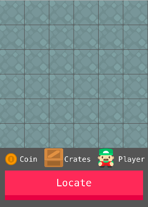

# WWDC17

To view this .playground you have to show the Assitant Editor in Xcode in order to display the UI.

You have to use Xcode 8.2.1, since there is a bug in the newer versions (8.3 and up) of Xcode which restricts interaction with a playground.

Screenshot:

